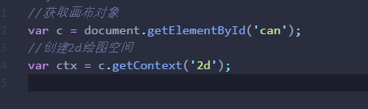
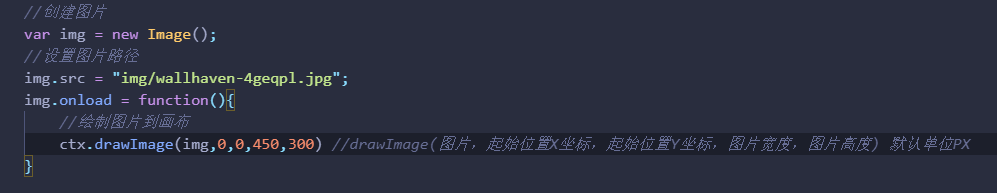
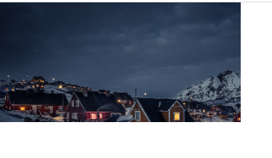
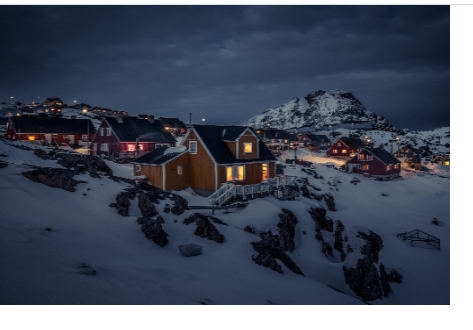
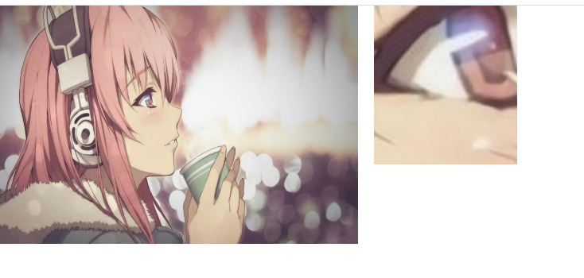

canvas画布功能在前端还是很方便的，可以实现很多精美的特效。这里记录下关于canvas的一个图片裁剪功能，通过这个功能可以对图片进行放大与缩小
<!--more-->
首先在HTML上需要定义一个canvas画布标签，由于画布本身是没有绘画能力的，所有工作必须要在js中完成。首先设置2D环境 

之后的命令都是在ctx这个对象的基础上进行的。 ctx就代表了绘图空间。
然后引入img图片，方法：drawImage(图片，起始位置X坐标，起始位置Y坐标，图片宽度，图片高度) 默认单位PX

在这里需要注意如果没有使用内联定义画布的宽度和高度就会导致图片不能全部显示
没有定义宽度和高度：

定义了高度和宽度：
 

最后对图片进行裁剪，方法：drawImage(img,sx,sy,sWidth,sHeight,x,y,width,height) sx,sy是裁剪的起始坐标；sWidth和sHeight是裁剪尺寸；x，y，是放置图片的坐标；width,height 放置图片的尺寸。

