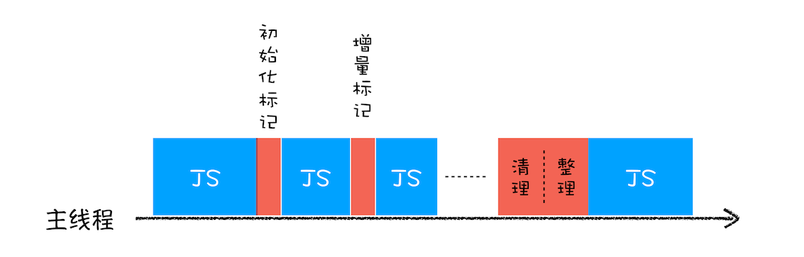

# V8垃圾回收机制

栈内存中： 调用栈中会存在一个指针 ESP 用来记录当前执行的函数上下文是哪一个。如果函数执行完毕，指针将会下移。下移后，如果调用栈再次压入函数执行上下文，那么就会替换掉要销毁的函数执行环境，不过这样的销毁如果没有新函数进入调用栈，就一直会保留要删除的函数变量

**代际假说和分代收集**

代际假说是指，对象在被创建后，其生命周期的大部分时间都在新生代，即绝大部分对象很快就会被销毁，只有少量对象会长久存在于老生代中。基于这个假说，V8 引擎使用了分代垃圾回收策略，将堆内存分为新生代和老生代两个区域，分别采用不同的回收算法进行垃圾回收。

新生代的垃圾回收方法是`Scavenge`算法。这种算法将新生代的内存空间一分为二，每一部分称为一个semispace。垃圾回收时，先将正在使用的`semispace`内存中的存活对象复制到未使用的`semispace`内存中，然后清空正在使用的`semispace`。这种算法的优点是实现简单，执行效率高，但是只能使用内存空间的一半，因此适合应用于对象生命周期短的场景。因为复制需要时间 所以为了执行效率 一般新生代的空间会设置的比较小。正是因为新生代的区域比较小，所以js 采用了`对象晋升机制`  （经过两次垃圾回收后还存在的对象将会被移动到老生代）

老生代采用 `Mark-Sweep` （标记-清除）和 `Mark-Compact` （标记-整理）两种算法进行垃圾回收。

`Mark-Sweep` 算法先遍历所有对象，标记出所有存活的对象，然后清除所有未标记的对象。这种算法的优点是实现简单，缺点是会产生大量不连续的空间碎片。

为了解决 `Mark-Sweep` 算法的碎片问题，V8 引擎同时采用 `Mark-Compact` 算法。该算法的第一步与 `Mark-Sweep` 算法相同，遍历所有对象，标记出所有存活的对象。第二步将所有存活的对象向一端移动，然后清理掉端边界以外的所有空间。

垃圾回收的流程

1. 第一步是标记空间中活动对象和非活动对象。所谓活动对象就是还在使用的对象，非活动对象就是可以进行垃圾回收的对象。
2. 第二步是回收非活动对象所占据的内存。其实就是在所有的标记完成之后，统一清理内存中所有被标记为可回收的对象。
3. 第三步 内存整理。频繁回收内存会产生大量不连续的内存空间 ，成为内存碎片，在分配较大连续内存时可能会出现内存不足。内存整理就是定时回收这些内存碎片，保证内存的可用性

全停时

在js引擎进行垃圾回收时，会阻塞js代码运行，如果内存数据量大，会引起页面卡顿不流畅，所以V8将标记过程分为了一个个子标记过程，与js代码交替运行，直至标记完成 这个算法成为**增量标记（Incremental Marking）算法**

