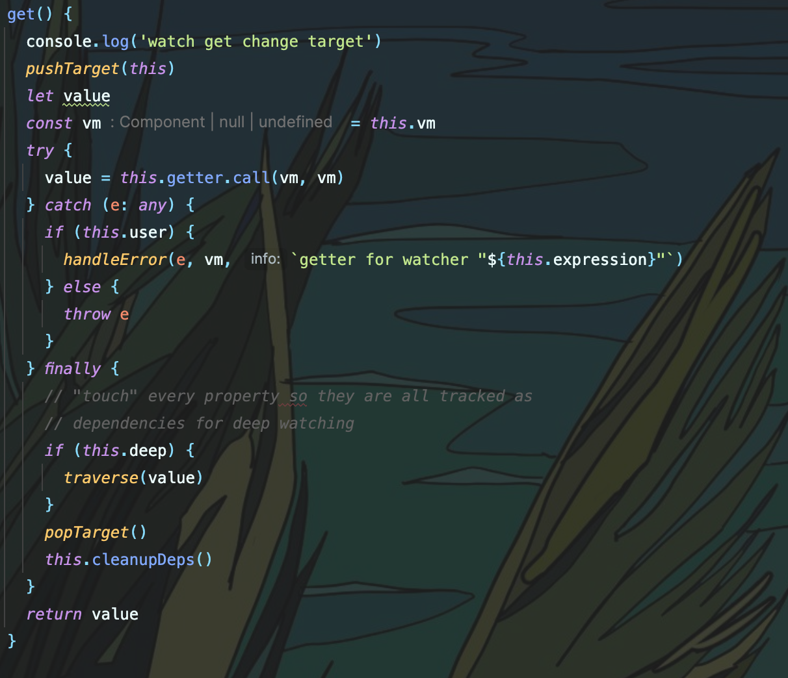
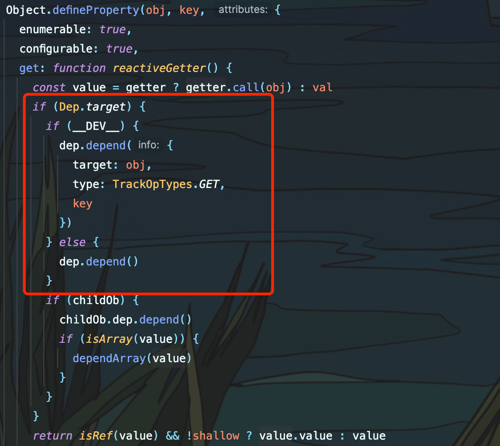
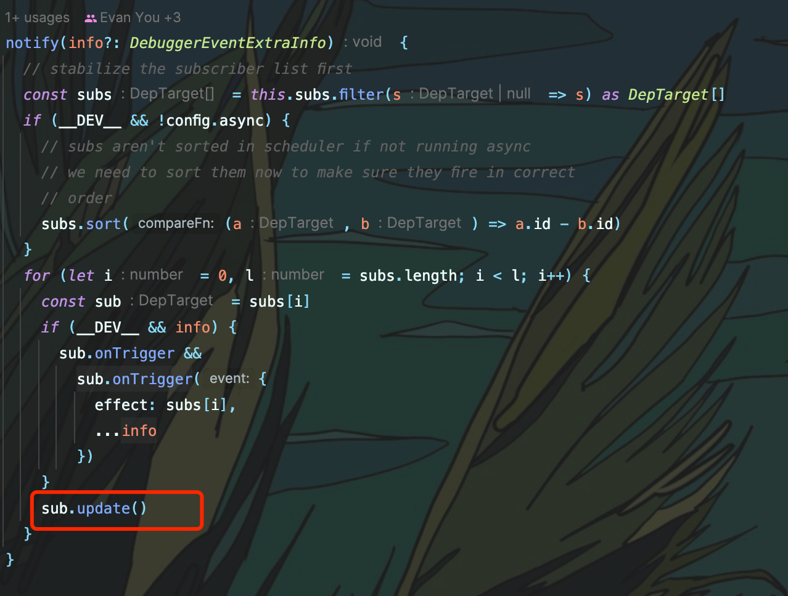
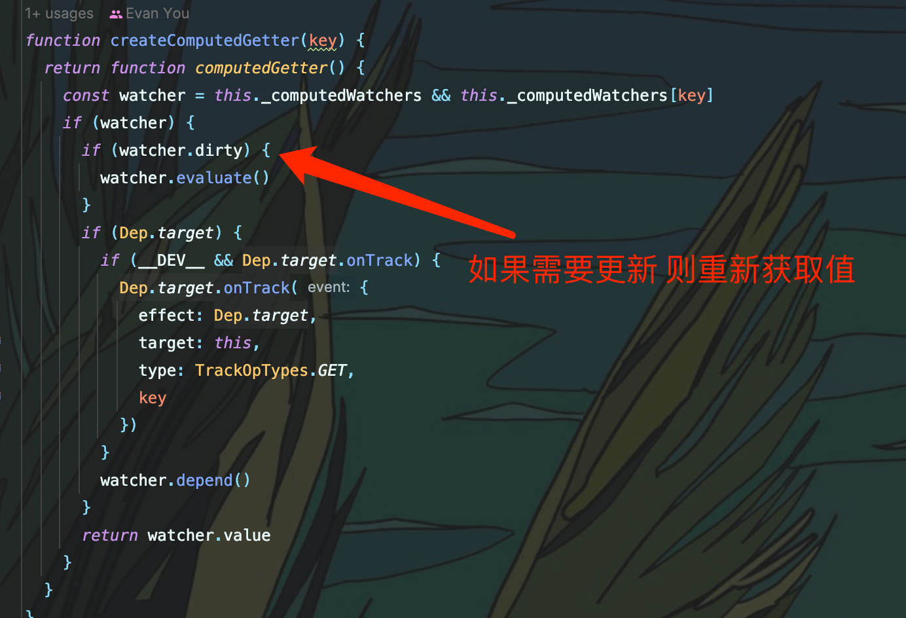

# vue computed
## 本文首先需要了解vue 中的数据响应式原理，了解Watcher 类 和 Dep类的作用。

关于vue中 计算属性的研究

vue中计算属性可以根据函数内的变量改变而自动运行 这是怎么做到的呢？

计算属性初始化时会创建一个watcher对象 绑定在`vm._computedWatchers` 上。这个对象存储着创建的计算属性监听器

## 监听机制

那么 computed是如何能根据函数内使用的data变量来达到自动计算的效果呢？

这就要靠`Dep`的依赖收集功能，在计算属性被获取时，会将当前`Watcher` 赋值给Dep.target 然后调用computed 的 getter 来获取值。getter函数中使用到的vue变量都会触发依赖劫持而调用get 而在get 中我们可以看到对当前Dep使用了depend依赖收集，这个Dep.target 就是当前计算属性所对应的Watcher 对象。

`depend`方法会将 Watcher 推入 变量Dep的subs 数组内， 当变量变化时就会触发计算属性的getter 方法重新计算值。

## 缓存机制

**computed** 的缓存机制 就是根据每个计算属性的 `Watcher` 中的 `dirty` 属性判断 如果`Watcher` 关联的`Dep` 有变化 就会把 `dirty` 改为`true` , 关联值没有更新则直接获取 `Watcher` 的 value 属性

总结一下就是当computed方法 计算运行时首先记录当前的Watcher，然后运行计算属性的求值函数。函数如果有调用Vue数据劫持的变量，就会触发该变量的getter方法，每个变量都会有一个`Dep`类来做依赖收集，一旦触发getter就会将当前的Watcher 对象推入subs 数组中。这样当这个变量被改变后 就会触发Watcher的update 方法重新计算值，如果没有更新，那么Watcher的 `dirty` 属性就会是false，则可以直接返回value，不需要重新计算。
