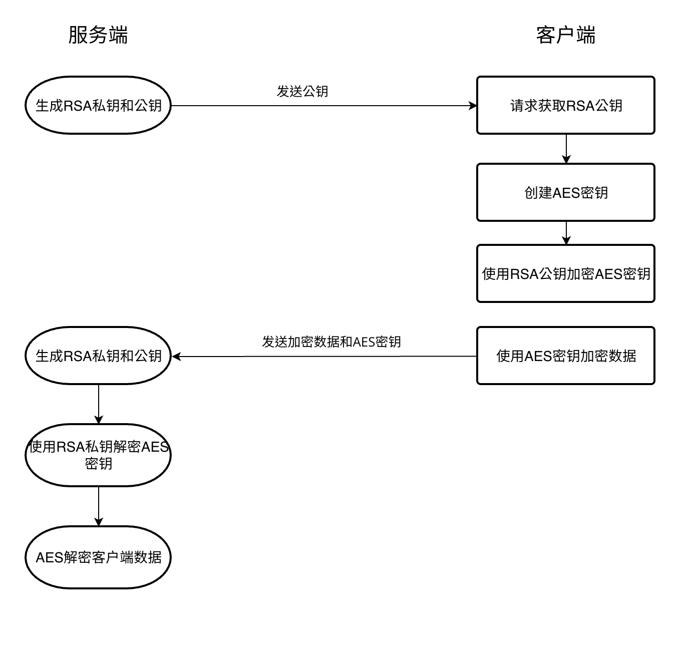
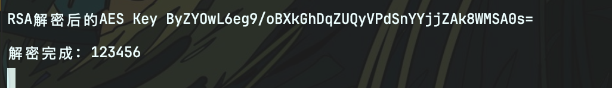

# 在Node.js 中使用RSA+AES混合加密通讯


### 加密方法
    首先简单介绍一下什么是RSA和AES
    RSA 和 AES 是两种常用的加密算法，它们在密码学中扮演着重要的角色，用于保护数据的安全性和完整性。它们的主要区别在于加密方式：RSA 是非对称加密算法，而 AES 是对称加密算法。


**1. AES (Advanced Encryption Standard) 高级加密标准**

* **类型：** 对称加密
* **密钥：** 使用相同的密钥进行加密和解密。
* **速度：** 加密和解密速度快，效率高。
* **安全性：** 在密钥长度足够长的情况下（128位、192位或256位），安全性高。
* **应用场景：** 适用于大量数据加密，例如文件加密、数据库加密、网络传输加密（如 VPN、TLS/SSL 中的数据加密部分）。

**2. RSA (Rivest–Shamir–Adleman) 算法**

* **类型：** 非对称加密
* **密钥：** 使用一对密钥：公钥和私钥。公钥用于加密，私钥用于解密。
* **速度：** 加密和解密速度相对较慢，计算复杂度较高。
* **安全性：** 基于大数分解的数学难题，在密钥长度足够长的情况下（通常为 2048 位、3072 位或 4096 位），安全性高。
* **应用场景：** 适用于少量数据加密，例如数字签名、密钥交换、身份验证。

### 使用场景

**在日常项目中 如果只是服务端加密解密，那么两个的安全性都是没问题的，但是如果涉及到客户端的加密，那么单独使用AES就要考虑密钥的安全性，单独使用RSA就要考虑大文件的加密性能。那么使用混合加密就能解决各自的痛点。**

### 如何进行混合加密

具体步骤如下：

1. [服务端生成RSA公钥和私钥，并保存在本地](#1)
2. [客户端加密时发起请求，服务端将公钥发送给客户端](#2)
3. [客户端生成AES随机密钥](#3)
4. [客户端根据RSA公钥加密AES随机密钥](#4)
5. [客户端使用AES加密数据](#5)
6. [发起请求 上传AES加密密钥和加密数据](#6)
7. [服务端解密](#7)




<center style="color: #cccccc">流程图</center>

---

> 下文将使用具体代码进行步骤的说明, 本文使用node.js express.js 进行服务端开发
> 客户端使用[`crypto-js`](https://www.npmjs.com/package/crypto-js)库进行 AES加密 [`node-forge`](https://www.npmjs.com/package/node-forge) 进行随机密钥的生成和RSA的加解密

<h3 id='1'>1.生成RSA密钥</h3>

使用node.js中内置的crypto 模块就可生成RSA公钥和私钥

```
import crypto from "crypto";

const { publicKey, privateKey } = crypto.generateKeyPairSync("rsa", {
  modulusLength: 2048,
});
```

<h3 id="2"> 2.服务端将公钥发送给客户端</h3>

将公钥通过接口发送给客户端，这里的公钥需要通过调用`export({ type: "pkcs1", format: "pem" })` 进行格式化导出

```javascript
app.get("/rsaKey", async (req, res) => {
    res.setHeader("Content-Type", "text/plain");
    res.send(
      successResponse(rsaPublicKey.export({ type: "pkcs1", format: "pem" })),
    );
  });
```


<h3 id="3">3.客户端生成AES随机密钥</h3>

使用node-forge生成随机的AES密钥 这里是生成`32字节(256位)`的随机字符串作为AES密钥

```javascript
import forge from "node-forge";
const aesKey = forge.random.getBytesSync(32);
```

<h3 id="4">4.RSA公钥加密AES随机密钥</h3>

`serverPublicKey` 为服务端发送过来的RSA公钥，这里使用`forge.pki.publicKeyFromPem(serverPublicKey);`将其转换成公钥对象，使用`encrypt`进行加密，这里的加密参数需要和服务端解密时设置匹配。

这里的 `this.key`和`this.iv`都是接下来AES加密所需要的参数 通过 `CryptoJS`提供的方法转换成对象

```javascript
import CryptoJS from "crypto-js";
import forge from "node-forge";
const { serverPublicKey } = opt;
const aesKey = forge.random.getBytesSync(32);
if (serverPublicKey) {
      const publicKey = forge.pki.publicKeyFromPem(serverPublicKey);
      this.rsaEncrypt = publicKey.encrypt(aesKey, "RSA-OAEP", {
        md: forge.md.sha256.create(),
      });
      // 转换成AES密钥对象
      this.key = CryptoJS.enc.Base64.parse(forge.util.encode64(aesKey));
      // iv是AES加密时的偏移值 这里使用了固定值，也可以像密钥一样使用公钥加密后传至服务器增加安全性
      this.iv = CryptoJS.enc.Utf8.parse("1234567890abcdef");
} else {
      throw new Error("Unsupported encryption key");
}
```

<h3 id="5">5.AES加密数据</h3>

这里的加密参数和服务端AES解密时要对应

```javascript
import { AES } from "crypto-js";
 function getOptions() {
    return {
      mode: CryptoJS.mode.CBC,
      padding: CryptoJS.pad.Pkcs7,
      iv: this.iv,
    };
  }
// AES 加密
  encryptByAES(cipherText: string) {
    return AES.encrypt(cipherText, this.key || "", this.getOptions()).toString();
  }
```

<h3 id="6">6.上传加密数据和加密AES密钥</h3>

客户端发送加密数据和加密后的AES密钥到服务端

```javascript
const encryption = new AesEncryption({
    serverPublicKey: rsaKey,
});
const password = encryption.encryptByAES(data.password);
userRegister({
    ...data, // 其他无需加密的数据
    key: encryption.getKey,
    password,
})
```

服务端获取加密后的AES密钥

```javascript
// 在class 中使用get直接获取加密后的AES密钥
get getKey() {
    try {
      return forge.util.encode64(this.rsaEncrypt);
    } catch (e) {
      console.log(e);
    }
  }
```

<h3 id="7">7.服务端 AES解密数据</h3>

调用`aesDecrypt`传入加密数据和加密的AES密钥
使用`decryptAESKey` RSA解密获取AES密钥

```javascript
// 配置加密参数
const algorithm = "aes-256-cbc"; // 加密算法
const iv = Buffer.from("1234567890abcdef", "utf8"); // 16字节的初始化向量
// RSA解密 AES 密钥
function decryptAESKey(encryptedKey) {
  const buffer = Buffer.from(encryptedKey, "base64");
  return crypto.privateDecrypt(
    {
      key: privateKey,
      padding: crypto.constants.RSA_PKCS1_OAEP_PADDING,
      oaepHash: "sha256",
    },
    buffer,
  );
}

// 解密函数
export const aesDecrypt = (encryptedText, key) => {
  try {
    console.log("RSA解密前", key);
    const aesKey = decryptAESKey(key);
    console.log("RSA解密后的AES Key", aesKey.toString("base64"));
    const decipher = crypto.createDecipheriv(algorithm, aesKey, iv);
    let decrypted = decipher.update(encryptedText, "base64", "utf8");
    decrypted += decipher.final("utf8");
    console.log("解密完成:", decrypted);
    return decrypted;
  } catch (e) {
    console.log(e);
  }
}
```

### 测试调用
#### 客户端 打印


#### 服务端 打印



    可以看到解密出来的数据和加密前的一致，需要注意加密过程和解密过程中 crypto 库的各种格式需要匹配 注意使用base64编码加密的也需要转成base64后进行解密

文章中项目的源码地址 [node-express-serve](https://github.com/ShetePro/node-express-serve)

