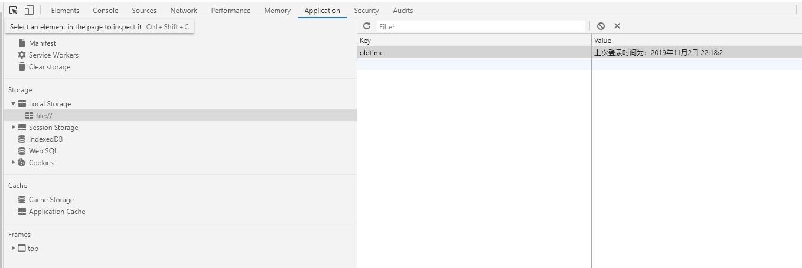
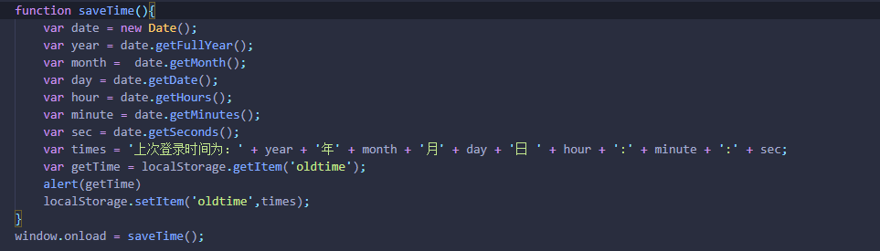

首先简单介绍一下LocalStorage和SessionStorage，这两个API都是用在储存数据的api
1. LocalStorage叫做本地储存
      - 同源策略：  存储在 localStorage 中的数据在同源（相同协议、主机和端口）页面间共享。这意味着在同一域名下的不同页面可以共享相同的。因此本地数据的安全也是需要考虑的方面
      - 持久性存储： 数据存储在 localStorage 中是持久性的，即使用户关闭浏览器标签页或者窗口，数据仍然存在，直到用户显式地清除浏览器缓存。
      - 大容量存储： 通常，localStorage 的存储容量较大（通常在 5 MB 到 10 MB 之间），适合存储大量数据.

2. SessionStorage会话储存
    - 同源策略：与 localStorage 类似，sessionStorage 遵循同源策略，提高了安全性。
    - 相对安全： 由于数据存在于用户的会话期间，因此对于一些敏感信息，使用 sessionStorage 比 localStorage 更安全。
    - 会话级别存储： 数据存储在 sessionStorage 中仅在当前页面会话期间有效，当用户关闭标签页或窗口时，数据将被清除。
    - 大小: 现代浏览器的 SessionStorage 容量都远远大于 5MB，如 Chrome 和 Firefox 都支持至少 10MB 的存储容量,但是，当 SessionStorage 存储的数据超过其容量限制时，浏览器会自动清除其中的数据，因此不应该将 SessionStorage 用于大量或大型的数据存储。

> 提示： localStorage和sessionStorage 的读写都是同步的，如果存储的数据量很大，可能会导致阻塞，影响页面性能。如果想在本地存储大容量数据，也可以使用IndexedDB、Web SQL Database等方法代替

可以在谷歌浏览器中查询到储存的数据：

关于LocalStorage和SessionStorage的方法，都有：
setItem(key, value) —— 保存数据，以键值对的方式存储信息
getItem(key) —— 获取数据，将键值传入，即可获取到对应的value值
removeItem(key) —— 删除单个数据，根据键值移除对应的信息
clear() —— 删除所有的数据
key(index) —— 获取某个索引的key

下图主要用LocalStorageAPI做了一个上次登录时间的例子：

